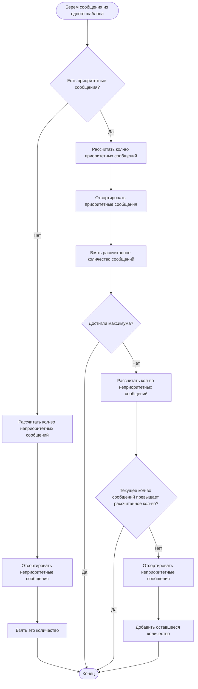

# Приоритетная отправка

За основу берутся:
- Линейное распределение рассылок, описанное ранее: равномерное, утреннее, дневное, вечернее.
- Параметр Template Fraction из текущего алгоритма работы планировщика
- Текущий алгоритм планирования

Я работаю только с линейным распределением. У него есть 4 вида распределения:
- Равномерное
- Утреннее
- Дневное
- Вечернее

Эти распределения описаны в старой доке, которую посылал.
Для нас сейчас главное - можем задавать приоритетное время отправки.

Что такое приоритет в распределении. Я определяю его так:
- Если при отправке сейчас, то сообщение будет доставлено в приоритетный промежуток (нужны таймзоны)
- Приоритетных сообщений надо взять больше, чем обычных (доставляемых не в приоритетный промежуток)

# Алгоритм планирования с приоритетными интервалами

Это алгоритм для планирования сообщений, шаблон которых задается распределением с приоритетами.
При планировании для каждого шаблона рассчитываются параметры, которые влияют на то сколько сообщений взять.

## Общий алгоритм планирования

Представленный алгоритм планирования выполняется при планировании каждой группы шаблонов.
Т.е. когда все сообщения были сгруппированы по приоритету и шаблону. 
В старом алгоритме, задавался параметр `TemplateFraction` - минимальное гарантированное место, которое могут занять сообщения с одним шаблоном.

В новом алгоритме, этот параметр вычисляется для каждого шаблона независимо от других - на основании параметров шаблона:
- Тип распределения (равн., утр., дневн., вечер.)
- Максимальная скорость отправки шаблона
- Максимальная общая скорость отправки (10000 в 1 минуту, например)

Ниже представлен алгоритм для определения количества отправляемых сообщений.

Из каждого диапазона (приоритетный и неприоритетный) выбираются исходя из сортировки по дате отправки/дате протухания.
Т.е. когда выбираем сообщения из приоритетного промежутка, то все они сортируются по кортежу (дата отправки/дата протухания), с неприоритетными - аналогично. 
Заметьте, что сортировка происходит независимо.

## Рассчет количества сообщений

В алгоритме были этапы с вычислением количества сообщений к отправке.
Вычисленное число - количество сообщений, которые мы _должны_ взять из всех доступных.

Вводятся 2 (1) параметра (tf - template fraction):
- $tf_p = max(0.05, 1/TemplatesCount)$ - доля приоритетных сообщений, по умолчанию равна `0.05`
- $tf_np = max(0.01, 1/TemplatesCount)$ - доля неприоритетных сообщений, по умолчанию равна `0.01`

`TemplatesCount` - количество различных шаблонов в текущей выборке.
Используется `max`, что обрабатывать ситуации, когда различных шаблонов мало - при константе будет отправлено только `0.05 * TemplatesCount` сообщений (мало).

> Замечание: смысл тот же самый, что и у текущего `template fraction`

Дополнительно:
- `MaxTemplateSendSpeed` - максимальная скорость отправки для каждого шаблона. Тот параметр, что и в БД `MAX_SEND_SPEED`
- `MaxSendSpeed` - максимальная общая скорость отправки. То число, что в Rate Limiter общем задается
- `interval` - интервал работы планировщика в минутах. Например, просыпается через каждую минуту, тогда - `1`, через 5 минут, тогда `5`

Из них вычисляются параметры:
- $MaxToSend = MaxSendSpeed * interval$ - максимальное кол-во сообщений, которые можем отправить за работу
- $TemplateMaxToSend = MaxTemplateSendSpeed * interval$ - максимальное количество сообщений одного шаблона, которое можем отправить

Теперь вычисляем сколько можем отправить сообщений:
- Кол-во приоритетных сообщений: `min(tf_p * MaxToSend, TemplateMaxToSend)`
- Кол-во неприоритетных сообщений: `min(tf_np * MaxToSend, TemplateMaxToSend)`

Таким образом:
- Если шаблонов будет мало, то все место заполнится одинаковыми (шаблон) сообщениями - не будет низкой производительности
- Если время отправки - приоритетное, то таких сообщений отправится больше - исходя из того, что их доля будет больше
- Вводится новый параметр(ы) - $tf_np, tf_p$, которые динамически могут изменяться и корректировать отправку.
- Из каждой группы шаблонов будет выбираться столько, сколько физически сможет отправиться за нужный интервал - `MaxSendSpeed` для каждого шаблона не будет превышен
- В результате, мы получим ровно столько сообщений, сколько можно будет отправить, исходя из лимита за интервал - используется общий лимит и интервал работы 

> Замечание: долю приоритетных сообщений можно рассчитывать исходя из доли неприоритетных. Например, $tf_p = tf_np * 5$.

# Алгоритм планирования для равномерного распределения

Если в шаблоне указано равномерное распределение, то алгоритм работы схож на тот, что есть сейчас.
Изменения, только в формуле рассчета кол-ва сообщений к отправке.

Рассчитывается кол-во по формуле: $ToSend = min(tf * MaxToSend, TemplateMaxToSend)$

`TemplateMaxToSend` и `MaxToSend` - те же самые параметры, что выше

`tf` - доля сообщений для этого шаблона. В отличие от приоритетных распределений, это значение постоянно.
Предлагаю сделать равным `max(0.03, 1/TemplatesCount)`. Значение 0.3 взято, как среднее арифметическое (`(0.05 + 0.01) / 2`) из 2 выше перечисленных долей.

Таким образом:
- Это значение будет подстраиваться, под малое кол-во шаблонов
- Когда есть приоритетные сообщения (других шаблонов), то приоритетных возьмется больше - больше доля
- Аналогично когда неприоритетный интервал (равномерных возьмется больше, и скорее всего больше отправится в приоритетный интервал)
